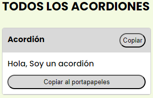

# Copypaste 

En este repo se encuentra una página en la cual podremos crear y modificar mediante el HTML, acordiones que poseeran un titulo y un contenido texto el cual será posible copiar.

A su vez estos componentes podrán ser filtrados según una categoría la cual especifiquemos o mediante un búscador.

## Uso

Estos acordiones fueron creados como webcomponents por lo cual cada etiqueta `<acordion-component>` tiene como estructura y estilo al archivo `Acordion.js`

No hace falta modificar el archivo que los hace funcionar pero es posible si se ha de modificar los estilos, agregar elementos o dinamismo.

Para comenzar estos están implementados en el index dentro de la sección acordiones de la etiqueta main

    <acordion-component title="Acordión" class="precio">
      Hola, Soy un acordión
    </acordion-component>

En el atributo `title` obviamente va a ir el titulo que va a aparecer en el encabezado del acordión y además nos va a permitir filtrar mediante el buscador.

En el atributo `class` irá en minúscula la categoría por la cual filtraremos con los enlaces del navbar.
Esto se modifica en `index.html` modificando los parametros que le pasamos a la función filtrarCategoria
tambíen el nombre de las categorias.

Y también en el `index.js` cambiando las categorias

Por último dentro de la etiqueta `acordion-component` debemos agregar una etiqueta `span` con el atributo `slot="contenido"` y dentro de este span el contenido de nuestro acordión, esto se hace para indicarle al webcomponent que es nuestro contenido a la hora de copiarlo e insertarlo en el HTML.

Resultado final:

